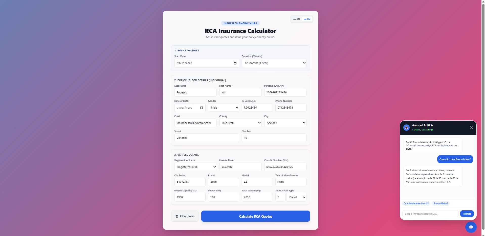
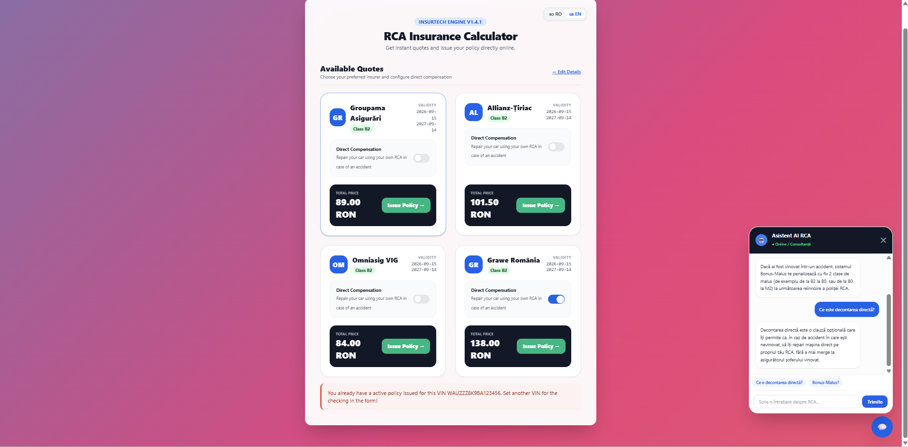
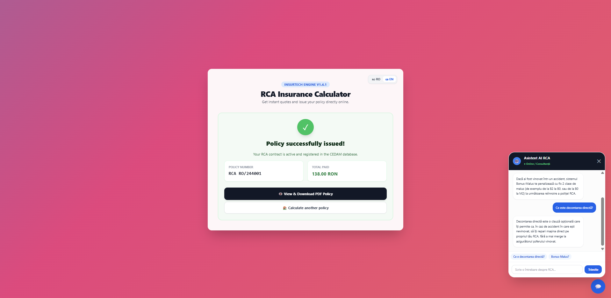
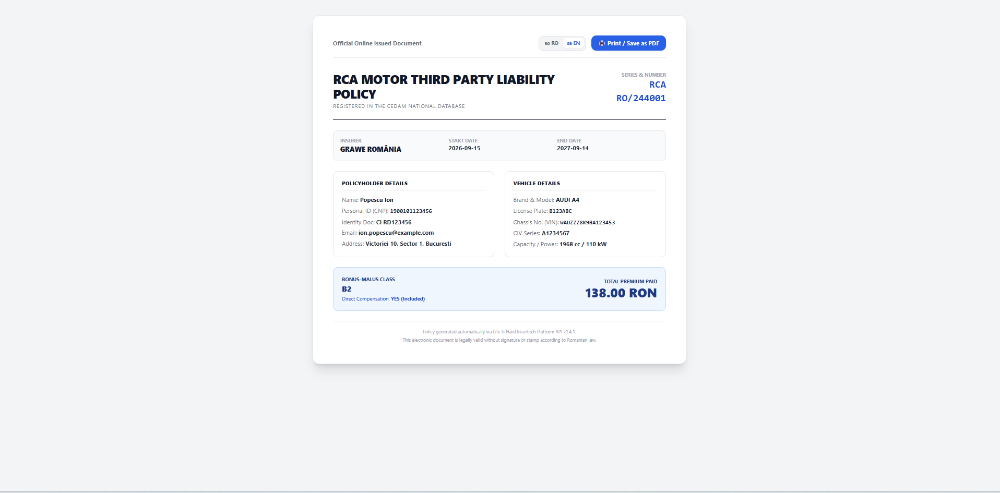
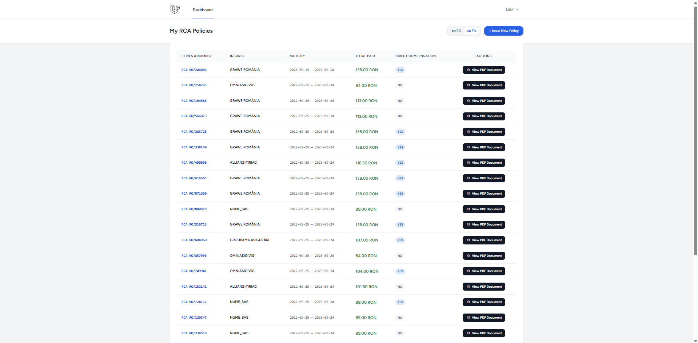
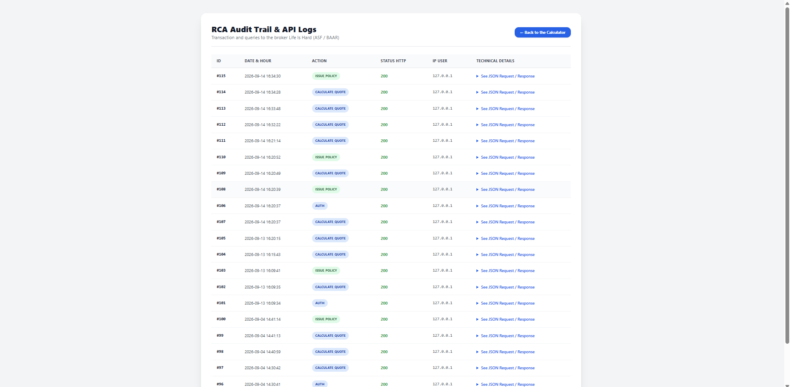

# RCA-Broker-Gateway 📝
Welcome to **RCA Broker Gateway**, a full-stack platform built with Laravel, MySQL, and Tailwind CSS to automate real-time comparasion, quoting, and instant online mandatory RCA policies in conformity with Romanian law. The application integrates directly with external broker REST APIs, strictly aligning with national ASF and BAAR requirements. Whether you are an everyday driver searching for the best prices and best rate or an administrator checking technical API payloads, RCA Broker Gateway streamlines the entire insurance lifecycle.

## Description 📑
RCA Broker Gateway delivers and end-to-end automated workflow where users can generate RCA quotes, evaluate Bonus-Malus rating levels, the configuration of optional direct compensation, and the issuance of official policy documents on the spot. The application includes a dedicated **User Dashboard**, where an user can track their current of previous policies, an **Admin Audit Trail** to inspect external REST API payloads and HTTP statutes, and an intelligent **AI Insurance Assistant** which can answer questions regarding the Romanian motor legislation in real time.

## Screenshots

### Form page and AI Chatbot

### Offers and AI Chatbot functionality

### Policy bought

### PDF Format for policy

### History log for policy of a certain user

### Audit trail log for ASF regulations and administrative control

## Features ⭐

* **Multi-step Form:** An asynchronous Single Page Application style wizard that collects the users information, official administrative code (SIRUTA), and vehicle specifications without full-page reloads.
* **Quote Engine:** Fetches live insurance rates from broker REST endpoints and displays the price comparasion, including Bonus-Malus rating classes and exact validity dates.
* **Direct Compensation Add-on:** A switch for the client to recalculate its offer and update the total payable premium when selecting optional direct claim handling.
* **Policy Issuance and Validation:** A secure transaction handler that verifies active policies, prevents duplicates of policies with the same VIN, and commits finalized contracts to customer profile.
* **Print and PDF Generation:** A dedicated print-ready Blade template that automatically strips UI buttons via CSS (@media print), generating clean, legally compliant policy documents for saving or printing.
* **Automated Email Dispatch:** Event-driven notification pipeline seding policy details and HTML certificate attachments immediatly upon issuance.
* **Admin Audit Trail:** Secured dashboard for monitoring; utilizing HTTP Basic Authentication to inspect paginated request/response payloads, correlation IDs, and external API latency.
* **Customer Dashboard:** Authenticated workspace for users allowing them to review their policy portofolio, verify validity dates, and re-download official documentation anytime.
* **Algorithmic CNP Parser:** Validation utility for the client that decodes birthdates and biological gender directly from the Romanian 13-digit Personal Identification Number via regex.
* **Bilingual Localization (RO/EN):** Instant in-browser translation between Romanian and English using vanilla JavaScript, preserving the user's language choice in localstorage across visits.
* **Layered Security Architecture:** Standardized session authentication with Bcrypt password hashing, signed verification URLs, CSRF token validation on AJAX requests, and rate-limiting middleware.
* **Embbeded AI RCA Assistant:** Chatbot integrated with Google Gemini API providing instant, context-aware advice on ASF regulations, Bonus-Malus adjustments, and claim resolution steps.

  
